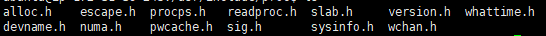
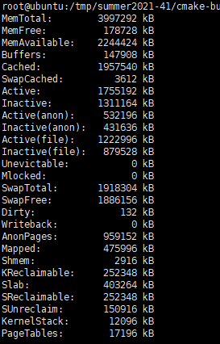
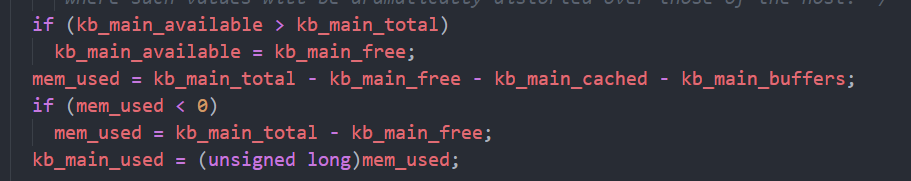
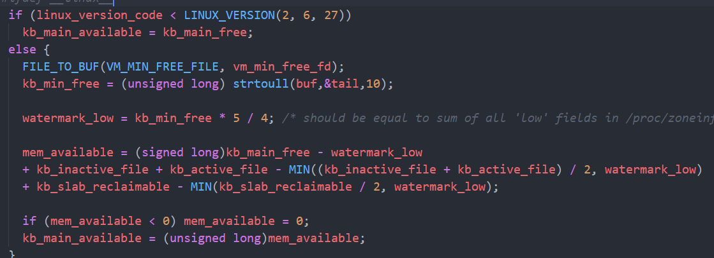
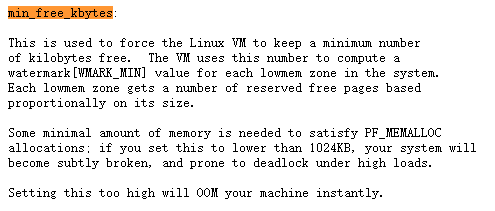
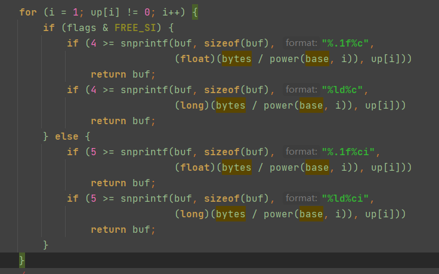
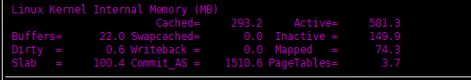
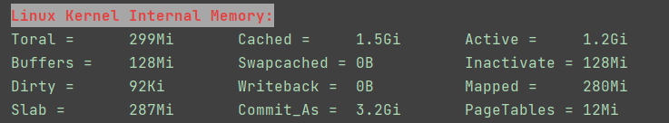
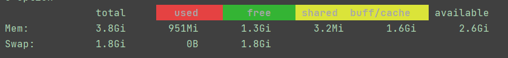

###  安装procps

+ 找到procaps工具包源码，其中包含free，top，ps等源码
+ 安装procaps工具库，`sudo apt install libprocps-dev`
+ 查看include的提供的头文件

+ 查看库文件

### proc/meminfo

+ 单位`kB`
+ 按照 “name: size kB”的 方式 记录系统内存的消耗情况。

+ memoinfo如何计算`used = total - free - cached - buffers`,并不是统计具体的某些项的内存消耗

+ available：available是对于每个程序而言可以申请的内存大小
+ 系统内存  = 空闲内存 + 内核内存 + 用户内存
+ 
  + 内核2.6.27之前，`available = free`，后面的版本有其他计算方法
  + 首先读取了`"/proc/sys/vm/min_free_kbytes"`文件https://blog.csdn.net/petib_wangwei/article/details/75135686，计算方式分析https://blog.csdn.net/wllabs/article/details/104284287
  + avaiable可能大于`free + buff/cached`，从上述计算方式可以看出还包括内核态`slab_reclaimable`可回收slab内存
  + 简单来说，这个文件记录了内核保留空闲内存的最小值，单位kB
  + 
  + `watermark`用来管理内存https://zhuanlan.zhihu.com/p/73539328，进行内存回收的阈值
  + `watermark_min`就是`min_free_kbytes`
  + `watermark_low`表示需要进行内存回收的阈值
  + `kb_active_file,kb_inactive_file`记录了与文件相关活跃与非活跃的关联内存大小
  + `sReclaimable, Sunreclaim`可回收slab与不可回收slab

+ free -h
  + 最多出现3位数字（如果有小数点，只能有两位数），所有单位从小到大进行尝试

### 粗略统计内核态使用内存统计

+ 粗略等于`total = slab + pagetables`还有一些其他部分没有进行统计，因为procps库没有向外部暴露这些内存。具体参考https://segmentfault.com/a/1190000022518282。
+ 显示方式参考`nmon`的内存显示方式。
+ 来自`proc/memoinfo`

### 为显示全局内存使用信息添加了颜色(类似于free)

+ 显示总的内存，使用了的内存，未使用的内存(free)，以及buff/cache，和程序可以使用内存(available)
+ 来自`/proc/memoinfo`

